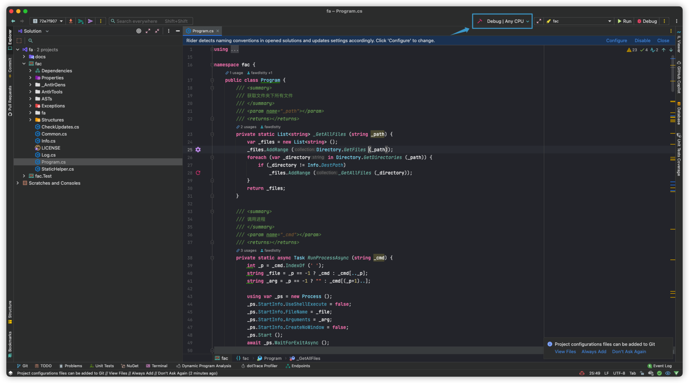

# 编译 Fa 语言编译器

本文将简单描述如何在 Windows / macOS（未完成） / Linux（未完成） 环境下使用 Visual Studio / JetBrains Rider（未完成） 编译 Fa 语言编译器

## Windows 环境

### 使用 Visual Studio

1. 准备一台安装着 Visual Studio 的电脑
2. 克隆 fa 编译器仓库（`git clone https://github.com/fa-org/fa.git`）
3. 如有必要，切换到某一个 tag
4. 打开 `fa` 路径下的 `fa.sln`
5. 点击菜单 `Build` 下的 `Publish to Folder...`

> 接下来的步骤中，默认选择发布到的路径为默认（`bin/Release/net5.0/publish`），如果你更改了路径，到你设置的路径中寻找即可。

5. 前往 `fa` 路径下的 `fac/bin/Release/net5.0` 
6. 该路径下的 `fac` 或者 `fac.exe` 即为编译器

------

## macOS 环境

### 使用 JetBrains Rider

1. 启动 JetBrains Rider
2. 前往欢迎页面（Welcome Screen）
3. 选择 `Get from VCS`，克隆 fa 编译器仓库（`https://github.com/fa-org/fa.git`）
4. 克隆完成后，如有必要，切换到某一个 tag

1. 在右上角的构建选择器位置（见上图蓝框），选择 `Release | Any CPU`，然后点击左侧的 `Build Solution`（锤子图标）或者前往 `Build` 菜单，选择 `Build Solution`
2. 右键左侧文件管理器中的 `fac`，选择 `Reveal in Finer`，在弹出的访达窗口中，你应当可以找到 `bin` 路径，前往 `bin/Release/net5.0` 路径。
3. 该路径下的可执行文件 `fac` 即为编译器 

## Linux 环境

::: warning Coming soon...
这部分正在施工
:::
